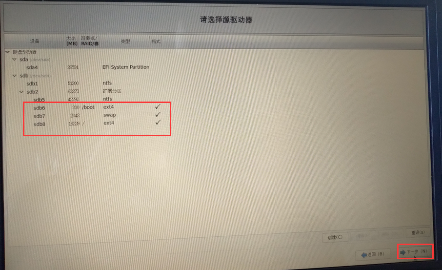
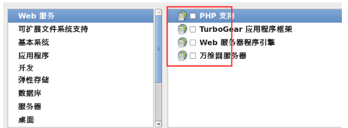
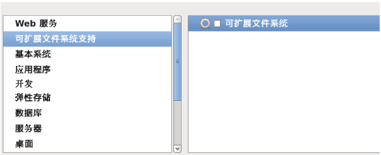
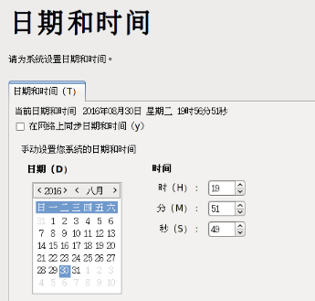

# 笔记信息
!> 这里记录了日常所用的一些笔记信息

# PC机安装linux CentOS6.10
## U盘启动盘制作
UltraISO制作U盘启动盘
1. 文件---打开 选择镜像文件

2. 启动-写入硬盘映像-写入

1. 写入后就完成了，同理，不需要把镜像文件拷到U盘。  
   遇到问题：  
   在系统U盘启动后提示`Press the <ENTER> key to begin the installation process`的画面，不管是X86_64 ,还是i386版本，都是卡在这里。  
   用记事本打开这个文件`syslinux\syslinux.cfg`，把第一行`default vesamenu.c32`替换为`default linux timeout 600 label linux kernel vmlinuz append initrd=initrd.img`这样修改之后，系统启动的时候就会跳过安装菜单选项界面，直接进入到语言选择界面  

## 安装过程
1. 选择语言  

2. 选择语言键盘  

3. 欢迎界面---下一步  

4. 选择存储设备--下一步  

5. 给计算机起名--下一步  

6. 选择时区---下一步  

7. 设置root密码---下一步  

8. 分区  
  
  
`/boot`分区`100mb`或者`200mb`  
  
`Swap（交换分区）`内存的1倍或者2倍 例如`2g内存`，swap分区设置为`2048`  
  
`/根分区`使用全部可用空间  
  
  
  
9. 点更改设备（千万注意引导程序安装的地方，引导写到电脑磁盘上的MBR，不是U盘的，千万注意）  
    `说明`:这一步至关重要,如果按照默认方式安装,会把系统启动引导安装到 U 盘里面,这也就是很多网友安装完系统之后,只要把 U 盘拔了,系统就启动不了,插上 U 盘系统又能正常启动的原因了!
      
    点`BIOS`驱动器顺序  
      
    第一`BIOS`驱动器:选择`本地磁盘驱动器`, 第二`BIOS`驱动器:选择`U盘驱动器`----点确定  
      
      
    定制系统软件`desktop`---现在自定义---下一步  
      
    Web环境  
      
    可扩展文件系统支持  
      
    基本系统  
      
    应用程序  
      
    开发、弹性存储、数据库、服务器可以都不勾，有需要，以后使用中有需要再手动安装  
    桌面  除了KDE，其他都选就可以  
      
    语言支持  
      
    系统管理、虚拟化、负载平衡器、高可用性可以都不选  
10. 完成配置，开始安装centos  
      
      
11. 安装完成，重新引导  
      
12. 欢迎引导页面  
      
13. 许可证  
      
14. 创建用户，可以先不创建，用root账户登录就行  
      
15. 时间和日期  
      
16. Kdump,去掉  
      
17. 重启后用root用户登录即可  
      